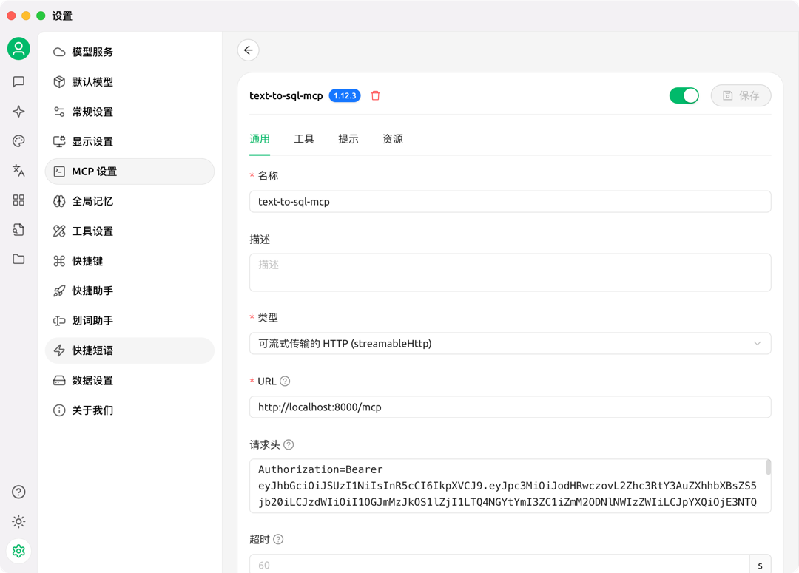

# Text-to-SQL MCP 服务器

一个基于 FastMCP 框架的安全数据库查询服务，用于数据库查询和分析。

## 🚀 项目简介

本项目是一个 MCP (Model Context Protocol) 服务器，专门用于提供安全的数据库查询服务。它基于 FastMCP 框架构建，支持 MySQL 数据库连接，并提供了完整的权限管理和安全控制机制。

## ✨ 主要功能

- **数据库连接管理**: 安全的 MySQL 数据库连接和查询
- **权限认证**: 基于 RSA 密钥对的 Bearer Token 认证
- **安全查询**: 防止 SQL 注入和危险操作的安全检查
- **表结构查询**: 获取数据库表列表和表结构信息
- **SQL 执行**: 安全的 SQL 查询执行，支持结果限制
- **健康检查**: 服务状态监控
- **权限管理**: 细粒度的权限控制

## 🛠️ 技术栈

- **Python 3.x**: 主要编程语言
- **FastMCP**: MCP 服务器框架
- **MySQL**: 数据库系统
- **uvicorn**: ASGI 服务器
- **python-dotenv**: 环境变量管理

## 📦 安装依赖

```bash
pip install -r requirements.txt
```

### 依赖包说明

python >=3.10

- `fastmcp==2.10.6`: MCP 服务器框架
- `python-dotenv==1.1.0`: 环境变量加载
- `mysql-connector-python==8.2.0`: MySQL 数据库连接器
- `uvicorn==0.24.0`: ASGI 服务器

## ⚙️ 配置

### 1. 环境变量配置

复制 `.env.example` 文件为 `.env` 并配置数据库连接信息：

```bash
cp .env.example .env
```

编辑 `.env` 文件：

```env
# 数据库配置
DB_HOST=localhost
DB_PORT=3306
DB_USER=your_username
DB_PASSWORD=your_password
DB_NAME=your_database

# 可选：服务器配置
MCP_HOST=127.0.0.1
MCP_PORT=8000
```

### 2. 数据库初始化

使用提供的 `dataset.sql` 文件初始化示例数据：

```bash
mysql -u your_username -p your_database < dataset.sql
```

该文件包含了一个 `contracts` 表的示例数据，包含合同信息。

## 🚀 启动服务

```bash
python mcp_server.py
```

服务启动后会显示：

```
Authorization=Bearer ...
🚀 启动MCP数据查询服务器...
📍 地址: http://127.0.0.1:8000
📋 可用工具:
   - health_check: 健康检查
   - get_user_permissions: 获取用户权限
   - get_database_tables: 获取数据库表列表
   - get_table_structure: 获取表结构
   - execute_sql_query: 执行SQL查询
   - generate_sql_from_question: 自然语言生成SQL
   - analyze_query_result: 查询结果分析
```

## MCP客户端配置


## 🔧 API 工具

### 1. 健康检查
- **工具名**: `health_check`
- **描述**: 检查服务和数据库连接状态
- **权限**: 无需特殊权限

### 2. 获取用户权限
- **工具名**: `get_user_permissions`
- **描述**: 获取当前用户的权限信息
- **权限**: 需要有效的访问令牌

### 3. 获取数据库表列表
- **工具名**: `get_database_tables`
- **描述**: 获取数据库中所有表的列表
- **权限**: 需要 `data:read_tables` 权限

### 4. 获取表结构
- **工具名**: `get_table_structure`
- **参数**: 
  - `table_name` (string): 表名
- **描述**: 获取指定表的结构信息、行数和样本数据
- **权限**: 需要 `data:read_tables` 权限

### 5. 执行 SQL 查询
- **工具名**: `execute_sql_query`
- **参数**:
  - `sql_query` (string): SQL 查询语句
  - `limit` (int, 可选): 返回结果的最大行数，默认 100
- **描述**: 安全执行 SQL 查询
- **权限**: 需要 `data:read_table_data` 权限
- **安全限制**: 禁止执行 DROP, DELETE, UPDATE, INSERT 等修改操作

## 🔐 安全特性

### 权限系统
- 基于 RSA 密钥对的 JWT Token 认证
- 细粒度权限控制：
  - `data:read_tables`: 读取表结构权限
  - `data:read_table_data`: 读取表数据权限

### 安全检查
- **SQL 注入防护**: 禁止危险的 SQL 操作
- **查询限制**: 自动添加 LIMIT 限制，防止大量数据查询
- **敏感数据保护**: 对包含敏感关键词的查询进行额外权限检查

## 📁 项目结构

```
text-to-sql-mcp/
├── mcp_server.py          # 主服务器文件
├── database.py            # 数据库管理模块
├── auth_token.py          # 认证令牌生成模块
├── requirements.txt       # 项目依赖
├── .env.example          # 环境变量示例
├── dataset.sql           # 示例数据库结构和数据
└── README.md             # 项目文档
```

## 🔍 核心模块说明

`mcp_server.py` 主服务器文件，包含：
- MCP 服务器初始化
- 所有 API 工具的定义
- 权限验证逻辑
- 安全检查机制

`database.py` 数据库管理模块，提供：
- MySQL 数据库连接管理
- SQL 查询执行
- 表结构信息获取
- 数据类型转换

`auth_token.py` 认证模块，负责：
- RSA 密钥对生成
- JWT 访问令牌创建
- 认证提供者配置

## 🚨 注意事项

1. **数据库安全**: 确保数据库用户权限最小化，只授予必要的查询权限
2. **网络安全**: 生产环境建议使用 HTTPS 和防火墙保护
3. **令牌管理**: 定期更新访问令牌，避免长期使用同一令牌
4. **查询监控**: 监控查询性能，避免复杂查询影响数据库性能

## 🤝 贡献

欢迎提交 Issue 和 Pull Request 来改进这个项目。

## 我的作品
n8n 工作流自动化模版站，收集了大量可直接使用的自动化流程：https://n8ntemplates.dev
